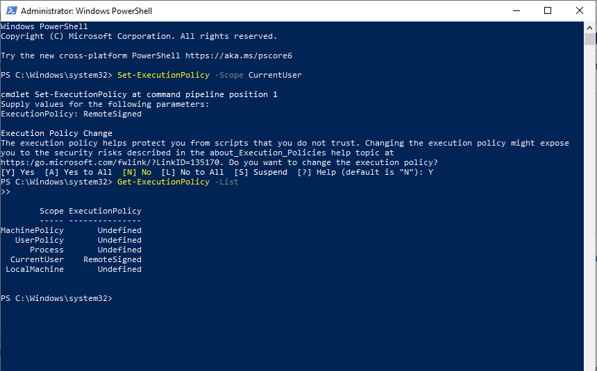
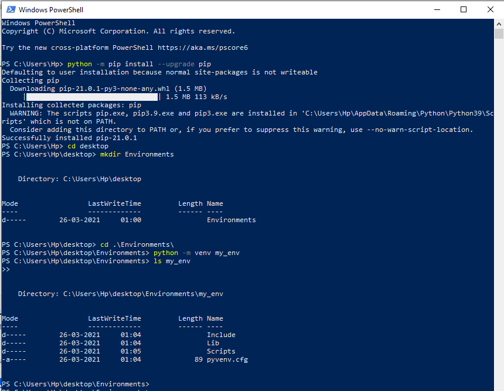
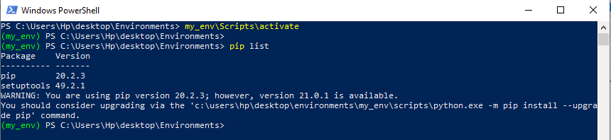
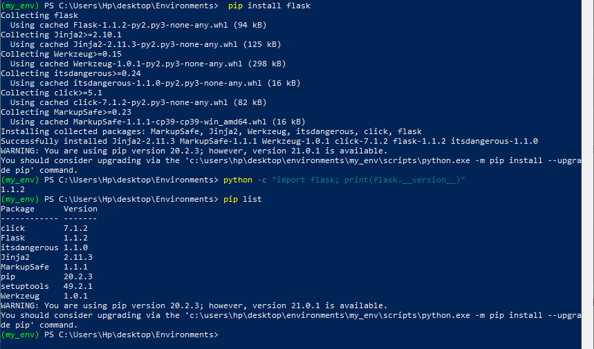
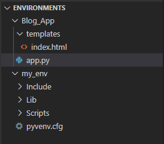
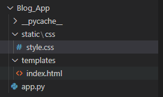
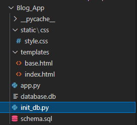

# Blog App

# Tech Stack
- HTML
- CSS
- BOOTSTRAP
- Flask
- Python

# Steps
1. Create a virtual environment using these commands:
    - Run Powershell as Administrator.
    - switch out of the system folder by typing the ``cd`` command.
    - Then set permissions by typing following commands:
        - ``Set-ExecutionPolicy -Scope CurrentUser``, Press Enter.
        - Type ``RemoteSigned``, Press Enter.
        - Type the letter ``y`` for “yes,” and allow the changes to take effect.
        - ``Get-ExecutionPolicy -List``, Press Enter.
        - 
    - Now, Let us create environment for our project.
        - Upgrade pip and create a new directory in which you would like to put your Python programming environments using ``mkdir`` command.
            - ``python -m pip install --upgrade pip``
            - ``mkdir Environments``
            - ``cd Environments``
        - Create an environment using the following command.
            - ``python -m venv my_env``
        - 
        - To use this environment, you need to activate it, which you can do by typing the following command that calls the activate script in the Scripts directory:
            - ``my_env\Scripts\activate``
        - 
    - Reference: https://www.digitalocean.com/community/tutorials/how-to-install-python-3-and-set-up-a-local-programming-environment-on-windows-10
2. Install Flask
    - ``pip install flask``
    - ``python -c "import flask; print(flask.__version__)"``
    - 
3. Using HTML templates
- Switch to your folder using cd command. and then create a file named ``app.py``. Copy paste the following code:

```
from flask import Flask, render_template

app = Flask(__name__)

@app.route('/')
def index():
    return render_template('index.html')
```

- Create a file named ``index.html`` in the directory named templates and add following code to it.

```
<!DOCTYPE html>
<html lang="en">
<head>
    <meta charset="UTF-8">
    <title>FlaskBlog</title>
</head>
<body>
   <h1>Welcome to FlaskBlog</h1>
</body>
</html>
```
- 
- Then, type following commands in powershell or terminal:
    - ``$env:FLASK_APP=app``
    - ``flask run``
    - 
- Open the URL http://127.0.0.1:5000/ in your browser to run the application.
- Now you need to change the environment from ``production`` to ``development`` remove the warning.
    - `` $env:FLASK_ENV = "development"``
    - ``flask run``
- Again, open the URL http://127.0.0.1:5000/.
4. Adding Styles to your HTML.
- Create a file named ``style.css`` inside folder ``css`` and ``static``. Add the following code to it.

```
h1 {
    border: 2px #eee solid;
    color: brown;
    text-align: center;
    padding: 10px;
}
```
- Add a link to the ``style.css`` file inside the ``<head>`` section of the ``index.html`` template file:

```
<link rel="stylesheet" href="{{ url_for('static', filename= 'css/style.css') }}">
```
- 
- Type ``flask run``, Enter.
- Open the URL http://127.0.0.1:5000/ to see the changes.
5. Base Jinja Template File
- To avoid unnecessary code repetition, we can use a base template file, which all of your HTML files will inherit from. To make a base template, first create a file called ``base.html`` inside your ``templates`` directory. Add the following code to it.

```
<!doctype html>
<html lang="en">
  <head>
    <!-- Required meta tags -->
    <meta charset="utf-8">
    <meta name="viewport" content="width=device-width, initial-scale=1, shrink-to-fit=no">

    <!-- Bootstrap CSS -->
    <link rel="stylesheet" href="https://stackpath.bootstrapcdn.com/bootstrap/4.3.1/css/bootstrap.min.css" integrity="sha384-ggOyR0iXCbMQv3Xipma34MD+dH/1fQ784/j6cY/iJTQUOhcWr7x9JvoRxT2MZw1T" crossorigin="anonymous">

    <title> </title>
  </head>
  <body>
    <nav class="navbar navbar-expand-md navbar-light bg-light">
        <a class="navbar-brand" href="{{ url_for('index')}}">FlaskBlog</a>
        <button class="navbar-toggler" type="button" data-toggle="collapse" data-target="#navbarNav" aria-controls="navbarNav" aria-expanded="false" aria-label="Toggle navigation">
            <span class="navbar-toggler-icon"></span>
        </button>
        <div class="collapse navbar-collapse" id="navbarNav">
            <ul class="navbar-nav">
            <li class="nav-item active">
                <a class="nav-link" href="#">About</a>
            </li>
            </ul>
        </div>
    </nav>
    <div class="container">
         
    </div>

    <!-- Optional JavaScript -->
    <!-- jQuery first, then Popper.js, then Bootstrap JS -->
    <script src="https://code.jquery.com/jquery-3.3.1.slim.min.js" integrity="sha384-q8i/X+965DzO0rT7abK41JStQIAqVgRVzpbzo5smXKp4YfRvH+8abtTE1Pi6jizo" crossorigin="anonymous"></script>
    <script src="https://cdnjs.cloudflare.com/ajax/libs/popper.js/1.14.7/umd/popper.min.js" integrity="sha384-UO2eT0CpHqdSJQ6hJty5KVphtPhzWj9WO1clHTMGa3JDZwrnQq4sF86dIHNDz0W1" crossorigin="anonymous"></script>
    <script src="https://stackpath.bootstrapcdn.com/bootstrap/4.3.1/js/bootstrap.min.js" integrity="sha384-JjSmVgyd0p3pXB1rRibZUAYoIIy6OrQ6VrjIEaFf/nJGzIxFDsf4x0xIM+B07jRM" crossorigin="anonymous"></script>
  </body>
</html>
```
- `` ``: Another block that will be replaced by content depending on the child template (templates that inherit from base.html) that will override it.
- Now, Replace the contents of ``index.html`` with following code.

```



    <h1> Welcome to FlaskBlog </h1>

```
5. Setting up the database.
-  we will be using ``sqlite3`` module to interact with the database, which is already available in the standard Python library.
- Create a file named ``schema.sql`` in your main directory and add the following code to it.
```
DROP TABLE IF EXISTS posts;

CREATE TABLE posts (
    id INTEGER PRIMARY KEY AUTOINCREMENT,
    created TIMESTAMP NOT NULL DEFAULT CURRENT_TIMESTAMP,
    title TEXT NOT NULL,
    content TEXT NOT NULL
);
```
- We will use ``schema.sql`` file to create the database using a Python file that will generate an SQLite .db database file. So, create a file named ``init_db.py`` inside the main directory and paste the following code.

```
import sqlite3

connection = sqlite3.connect('database.db')


with open('schema.sql') as f:
    connection.executescript(f.read())

cur = connection.cursor()

cur.execute("INSERT INTO posts (title, content) VALUES (?, ?)",
            ('First Post', 'Content for the first post')
            )

cur.execute("INSERT INTO posts (title, content) VALUES (?, ?)",
            ('Second Post', 'Content for the second post')
            )

connection.commit()
connection.close()
```
- Now, run ``python init_db.py`` command in your terminal. If a new file called ``database.db`` will appear in your main directory. This means you’ve successfully set up your database.
- 
